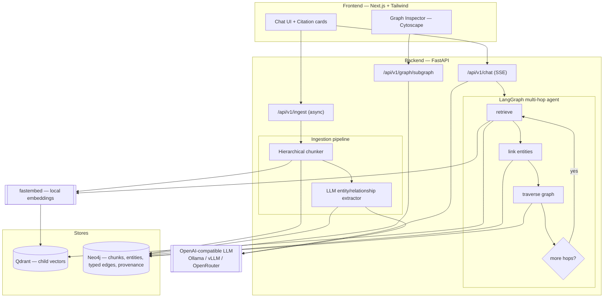
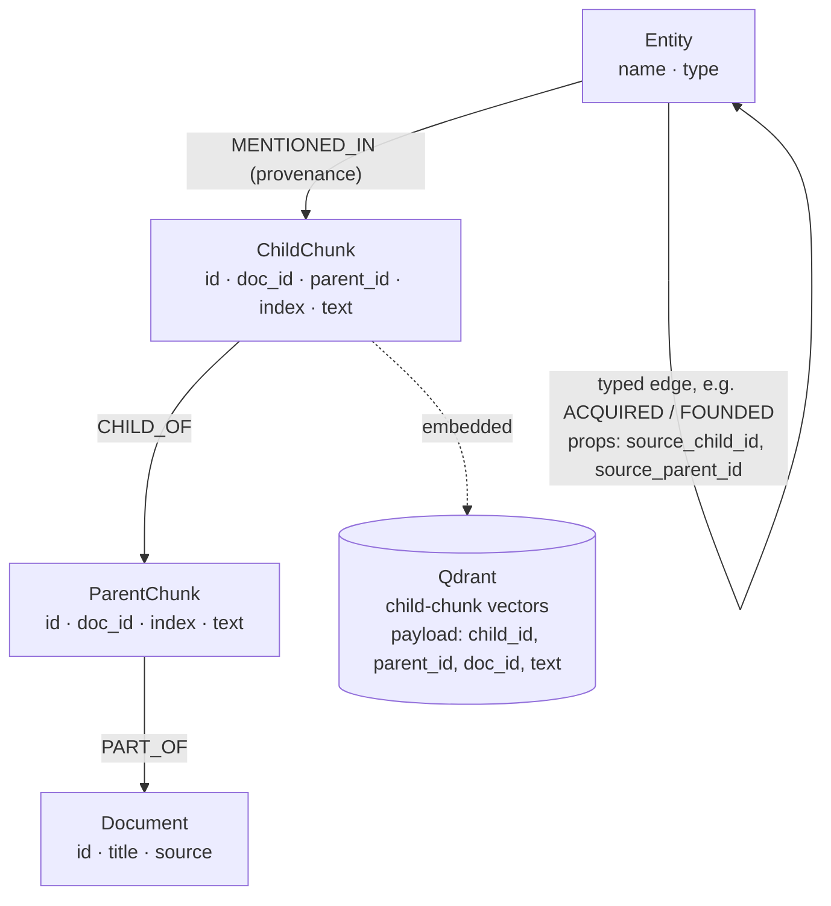

# GraphRAG Explorer

[](https://github.com/nabaruns/graphrag-hierarchical-chat/actions/workflows/ci.yml)

A full-stack, production-oriented **GraphRAG** application. It ingests documents
with **parent-child hierarchical chunking**, extracts an **entity-relationship
knowledge graph** with an LLM, and serves an interactive chat UI whose answers
fuse **vector similarity search** with **multi-hop graph traversal**. Every
answer streams token-by-token with expandable citation cards and an interactive
graph inspector.

The entire stack (UI, API, graph DB, vector DB, and a self-hosted LLM) comes up
with a single `docker compose up`, with **no external API keys required**.

---

## Demo

[](https://youtu.be/0uT8Y4iIz7U)

▶️ **[Watch the explainer video](https://youtu.be/0uT8Y4iIz7U)** — a short walkthrough of
hierarchical ingestion, knowledge-graph extraction, and the streaming chat + graph inspector.

🔗 **Live demo:** <https://graphrag-hierarchical-chat.vercel.app> (free-tier backend may take ~30-60s to wake on the first request)

---

## Highlights

- **Hierarchical (small-to-big) indexing** — small ~200-token child chunks are
  embedded for precise retrieval, then expanded to their ~1000-token parent
  blocks for rich generation context.
- **Knowledge-graph extraction** — named entities (nodes) and explicit typed
  relationships (edges, e.g. `(Company)-[ACQUIRED]->(Startup)`) are extracted via
  LLM structured output and stored as real, queryable Neo4j relationship types.
- **Provenance mapping** — entities and relationships link back to the exact
  child and parent chunk IDs they came from.
- **Multi-hop agentic retrieval** — a LangGraph agent loops vector-retrieve →
  entity-link → graph-traverse, re-seeding later hops with newly discovered graph
  neighbours.
- **Streaming API** — `/chat` streams grounded answers over Server-Sent Events,
  emitting citations and the query subgraph before the tokens.
- **Config-driven LLM** — any OpenAI-compatible endpoint (Ollama, vLLM,
  OpenRouter) via env vars, no code change.
- **Abuse protection** — per-IP rate limiting (default 2 req/min) and optional
  Cloudflare Turnstile on the expensive `/chat` and `/ingest` endpoints.

---

## Architecture



### Data model (Neo4j)



> Boxes are node labels (`:Document`, `:Entity`, …); the self-loop on `Entity`
> is the typed `(:Entity)-[…]->(:Entity)` relationship.

Neo4j is the source of truth for text, structure, and the graph; child-chunk
**vectors** live in Qdrant, linked back by `parent_id` / `child_id` for
small-to-big expansion and citation.

<details>
<summary>Exact schema (Cypher-style)</summary>

```
(:Document {id, title, source})
(:ParentChunk {id, doc_id, index, text})
(:ChildChunk  {id, doc_id, parent_id, index, text})
(:Entity {name, type})

(:ParentChunk)-[:PART_OF]->(:Document)
(:ChildChunk)-[:CHILD_OF]->(:ParentChunk)
(:Entity)-[:MENTIONED_IN]->(:ChildChunk)                          # provenance
(:Entity)-[<TYPE> {source_child_id, source_parent_id}]->(:Entity) # typed edge
```

</details>

---

## Quickstart

### Prerequisites
- Docker + Docker Compose
- ~4 GB free disk for the model + images. First boot downloads the Ollama model
  (~2 GB) and the embedding model (~130 MB).

### Run

```bash
docker compose up --build
```

Then open:

| Service        | URL                          |
|----------------|------------------------------|
| Chat UI        | http://localhost:3000        |
| API docs       | http://localhost:8000/docs   |
| Neo4j Browser  | http://localhost:7474 (neo4j / password123) |
| Qdrant         | http://localhost:6333/dashboard |

> First startup takes a few minutes while the LLM model is pulled. The `api`
> service waits for the model to be ready via a healthcheck.

### Try it

1. Go to the **Ingest** tab and click **Load sample dataset** (or paste your
   own). Wait for status `completed`.
2. Switch to **Chat** and ask a question. The answer streams in with citation
   cards, graph-relationship chips, and the subgraph rendered on the right.

---

## Sample queries

Using the built-in sample dataset:

- *"Who acquired DataStart, and who founded it?"*
- *"What is StreamIQ built on and which company owns it now?"*
- *"How is Dr. Elena Reyes connected to Marcus Chen?"* (multi-hop)
- *"Which companies has TechCorp acquired?"*

The last two exercise multi-hop traversal: the answer is assembled from graph
relationships that no single passage states outright.

---

## Configuration

All backend settings are environment variables (see `backend/.env.example`).
Key ones:

| Variable          | Default                         | Purpose |
|-------------------|---------------------------------|---------|
| `OPENAI_BASE_URL` | `http://ollama:11434/v1`        | OpenAI-compatible LLM endpoint |
| `OPENAI_API_KEY`  | `ollama`                        | Placeholder for Ollama; real key for OpenRouter |
| `LLM_MODEL`       | `qwen2.5:3b-instruct`           | Chat/extraction model |
| `EMBEDDING_MODEL` | `BAAI/bge-small-en-v1.5`        | Local fastembed model (384-dim) |
| `TOP_K`           | `5`                             | Vector results per hop |
| `MAX_HOPS`        | `2`                             | Graph traversal depth |
| `MAX_ITERATIONS`  | `2`                             | Multi-hop retrieve/traverse loops |

### Swapping the LLM provider

The app never hardcodes a provider. To use a hosted model instead of the
self-hosted default, change three env vars:

```env
# OpenRouter
OPENAI_BASE_URL=https://openrouter.ai/api/v1
OPENAI_API_KEY=sk-or-...
LLM_MODEL=openai/gpt-4o-mini
```

Note: embeddings are always computed locally with fastembed, since chat-only
endpoints (OpenRouter, Ollama) do not serve an embeddings API.

---

## API reference

| Method | Path                       | Description |
|--------|----------------------------|-------------|
| POST   | `/api/v1/ingest`           | Async ingest; returns a `job_id` (202) |
| GET    | `/api/v1/ingest/{job_id}`  | Ingestion job status + counts |
| POST   | `/api/v1/chat`             | GraphRAG answer, streamed as SSE |
| GET    | `/api/v1/graph/subgraph`   | Node/edge JSON for visualization |
| GET    | `/api/v1/graph/stats`      | Graph counts |
| GET    | `/health`                  | Liveness |

`/chat` SSE event order: `citations` → `subgraph` → many `token` → `done`.

Example:

```bash
curl -N -X POST http://localhost:8000/api/v1/chat \
  -H 'Content-Type: application/json' \
  -d '{"query": "Who acquired DataStart?"}'
```

---

## Project structure

```
.
├── backend/
│   ├── app/
│   │   ├── main.py                # FastAPI app + lifespan
│   │   ├── config.py              # env-driven settings
│   │   ├── llm.py  embeddings.py  # OpenAI-compatible client + fastembed
│   │   ├── models/schemas.py      # Pydantic models
│   │   ├── ingestion/             # chunker, extractor, pipeline
│   │   ├── stores/                # qdrant + neo4j wrappers
│   │   ├── graph_rag/             # LangGraph agent, retrieval, generation
│   │   └── routers/               # ingest, chat, graph
│   └── tests/
├── frontend/                      # Next.js + Tailwind + Cytoscape
├── k8s/                           # GPU/production manifests (vLLM)
├── docs/sample_documents.json
└── docker-compose.yml
```

---

## Tests

```bash
cd backend
pip install -r requirements.txt
pytest
```

Tests are offline: chunking, extraction normalization, small-to-big expansion,
and API/SSE behaviour all run with the LLM and stores mocked.

---

## Design trade-offs: retrieval accuracy vs. latency

- **Hierarchical chunking.** Embedding small children maximizes match precision;
  expanding to parents restores the context an LLM needs. Bigger parents improve
  answer quality but cost prompt tokens and latency. Defaults: 200 / 1000 tokens.
- **Graph fusion.** Vector search alone misses facts spread across passages;
  N-hop traversal recovers them, but each hop adds Cypher round-trips and a
  second vector query. `MAX_HOPS`/`MAX_ITERATIONS` bound this; default 2.
- **Extraction granularity.** Extraction runs per *parent* chunk: fewer LLM calls
  than per-child while keeping enough context to capture cross-sentence
  relationships. This is the dominant cost of ingestion.
- **Local, CPU-first LLM.** The default `qwen2.5:3b-instruct` on Ollama needs no
  key and no GPU, trading raw extraction quality and speed for portability. Point
  `OPENAI_BASE_URL` at vLLM (see `k8s/`) or a 7B+ model for higher fidelity.
- **Local embeddings.** `bge-small` (384-dim) is fast and CPU-friendly; a larger
  embedding model would raise recall at higher memory/latency cost.
- **No reranker.** A cross-encoder rerank step would sharpen top-k precision but
  adds a model and latency; deliberately omitted to keep the pipeline lean.
- **Streaming first.** Citations and the subgraph are sent before tokens so the UI
  is useful immediately while generation (slow on CPU) streams in.
- **In-memory job registry.** Ingestion jobs are tracked in process for
  simplicity; a durable queue (Redis) would be the production choice.

---

## License

MIT — see [LICENSE](LICENSE).
